# 00-神经网络基础

Relu函数

预测房价,我们有很多因素,

我们将这些因素结合起来

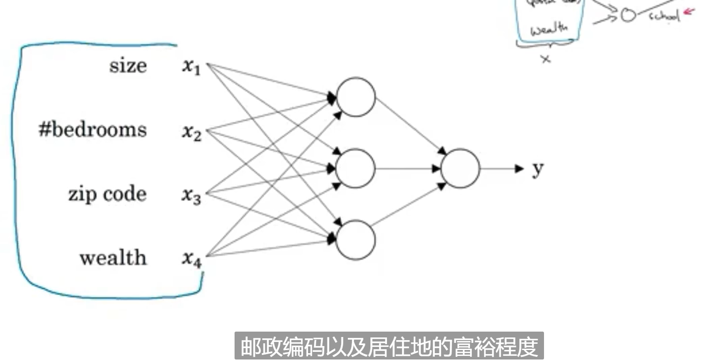

就得到Y

输入层 全连接

神经网络的应用: 预测广告, 标记照片分类, 语音识别,

## 二分分类

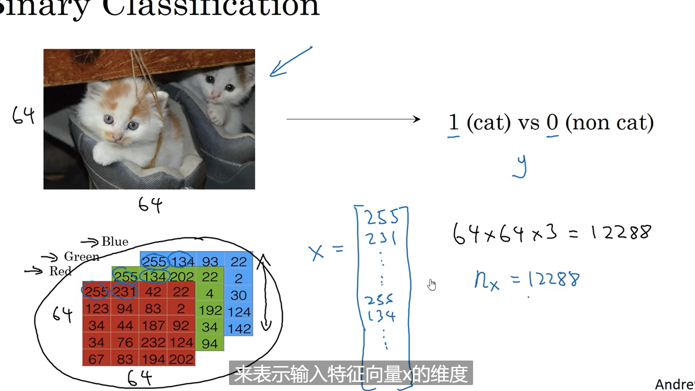

单个样本由(x,y)组成

1. 前向传播
2. 反向传播

## 逻辑回归

预测猫若线性回归, 线性回归不满足0或1

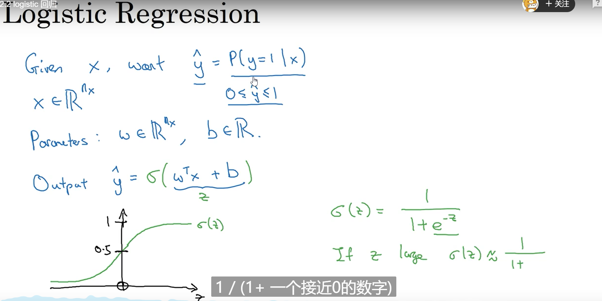

所以用sigmod函数加上,这样就在0-1之间

这样就是满足要么0, 要么1

通常将 w和b分开

### 代价函数

Lost function

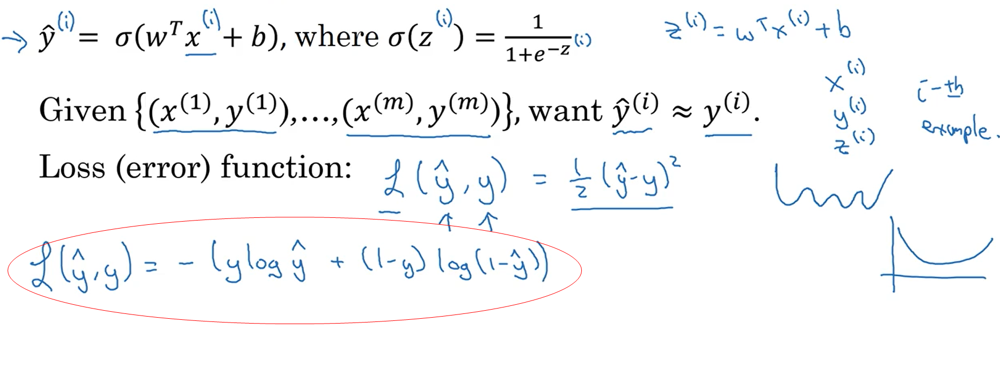

Cost function 

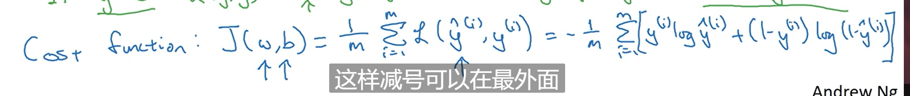

找W和b来缩小J

## 梯度下降法

损失函数可以衡量训练集上的效果

梯度下将就是往下降最快的方向走, 就是求导数,然后往反的来,增长最快的反方向

α为学习率

w := w - α * dw

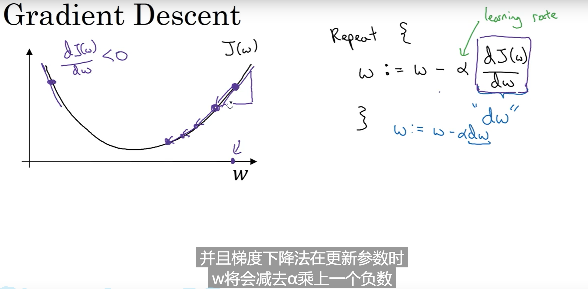

左边导数为负数,所以减去后就变+了,就往中间走,右边导数为正数, -了就一样往中间走,为的就是招最低点, 同时步长也要选好, 下降太快找不到最低点,下降太慢需要太长时间, 所以需要选好α

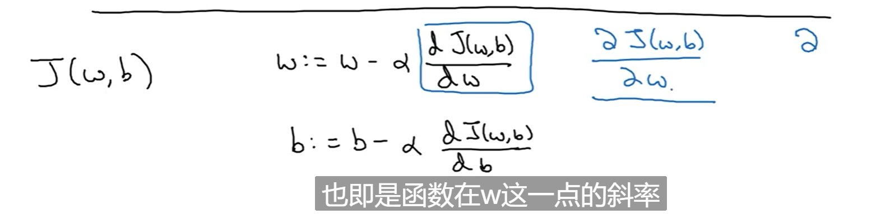

## 微积分和导数

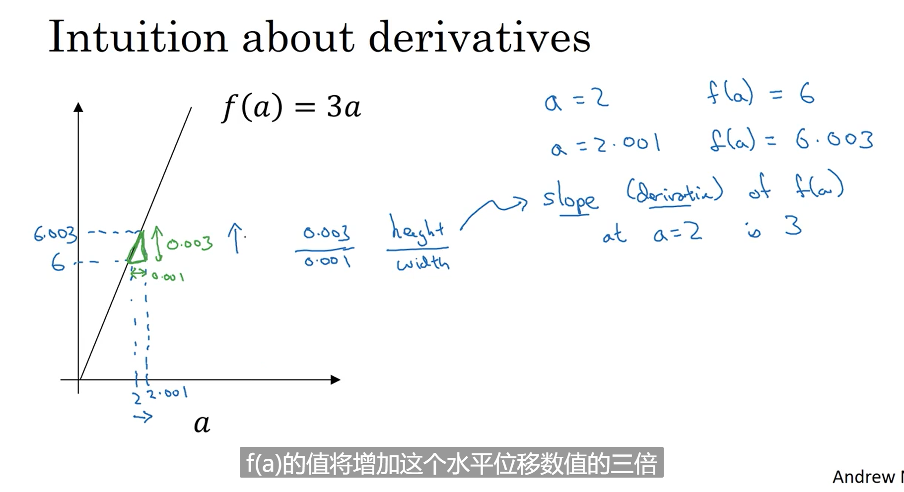

斜率说明, 实际就是导数, f(a) 求导= 3

增加横坐标后,y坐标增加为横坐标的增加的数值的3倍

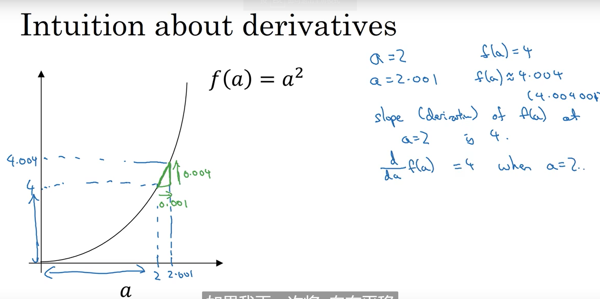

这是我看错,还是他算错了, 应该为4.002, 因为f(a) ' = 2a

## 计算图

类似复合函数求导

正向传播

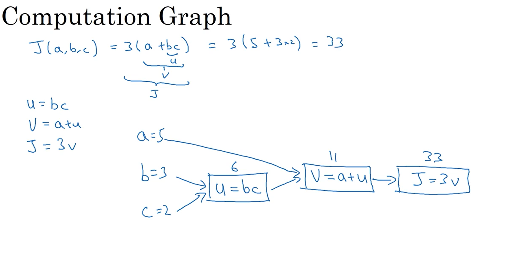

反向传播

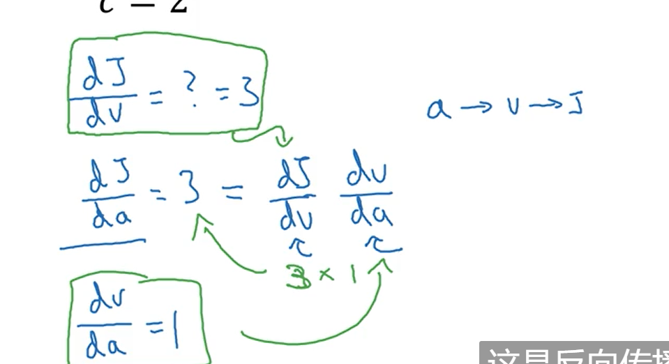

链式法则

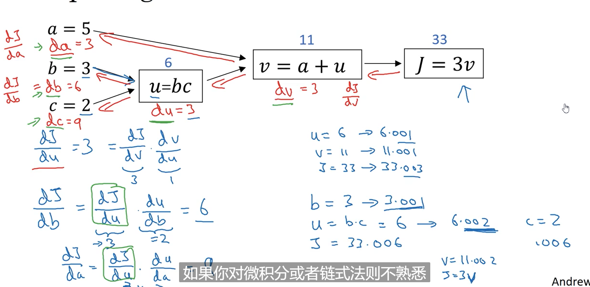

也不是很难理解, dj/dv=3, 然后一直推

dj/da = dj/dv * dv/da= 3 * 1 =3

dj/du = dj/dv * dv/du = 3*1 =3

dj/db = dj/du * du/db = 3*2 =6

dj/dc = dj/du * du/dc = 3*3 = 9

## 逻辑回归中的梯度下降法

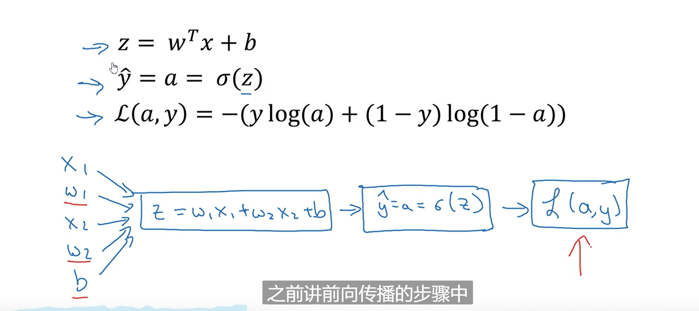

修改w和b来减小损失函数

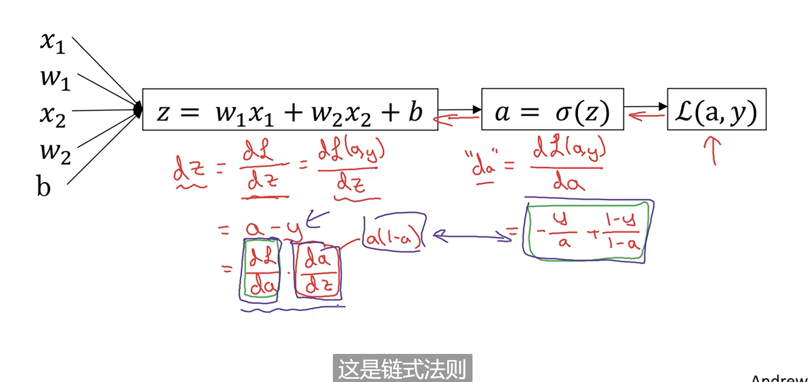

往前求,最后计算出每个参数对L的影响

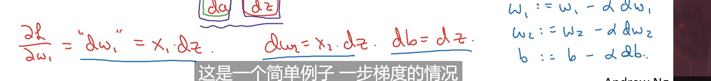

求出后,就可以用梯度下降法计算了

## m个样本的逻辑回归

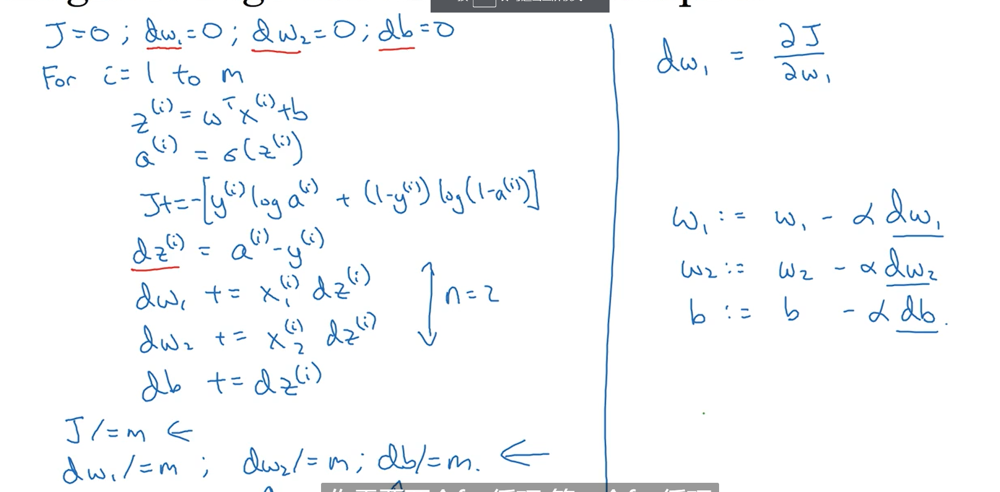

引入矢量化技术, 摆脱for循环

## 向量化

np.dot(W,x)

w.T.dot(x)

将循环转成矩阵

## 向量化逻辑回归

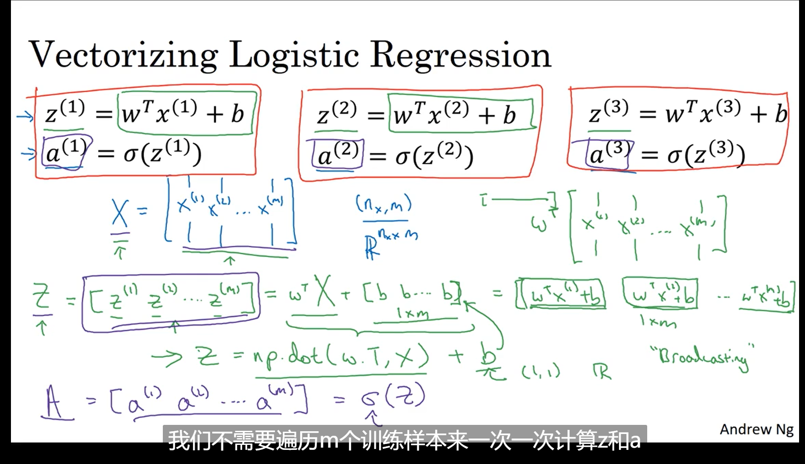

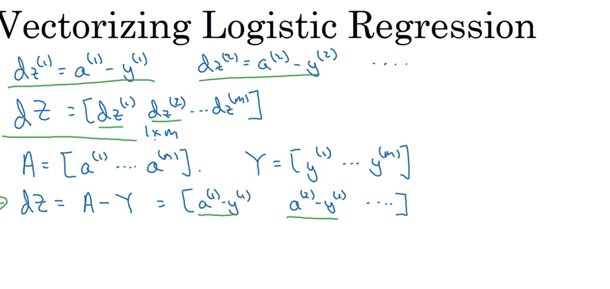

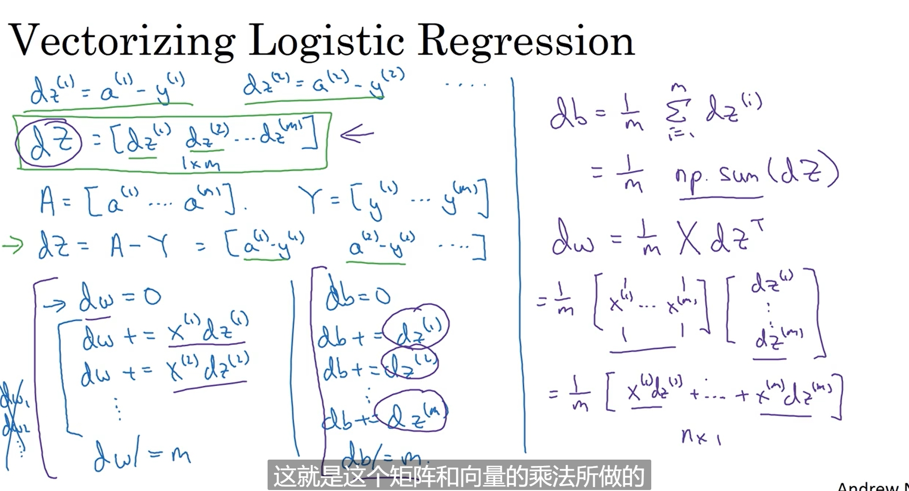

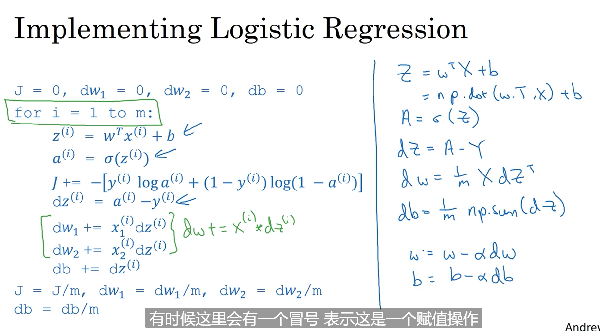

这里用矩阵简化了很多操作,循环

,最后需要一个循环来迭代次数, 梯度下降的次数

## 广播

axis=0 沿垂直方向求和

cal =A.sum(asix=0)

reshape矩阵形状 O(1)时间复杂度

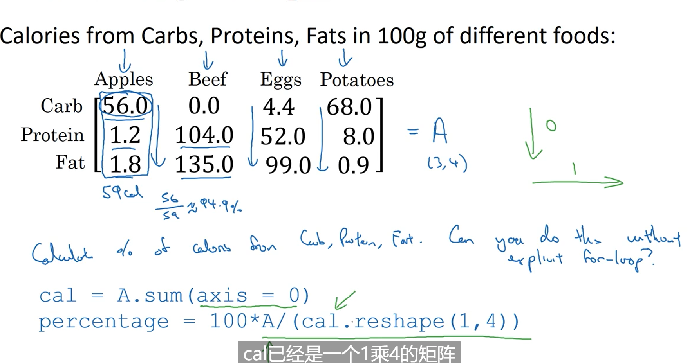

广播例子2

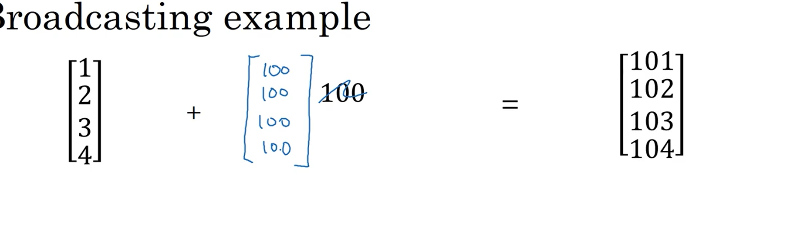

将100自动扩充

广播例子3

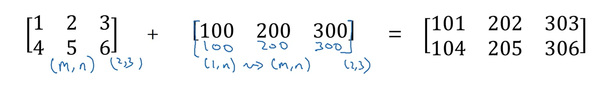

通用广播规则:

(m,n) + (1,n) =>(m,n) +(m, n)

同样的一个数也会被扩充成行向量或者列向量

不要使用未声明的秩, 比如(5,) (,5) 这种,而使用(5,1) 这种显示声明的

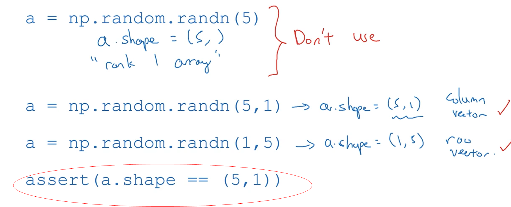

利用断点判断

