# 01-浅层神经网络

## 神经网络概览

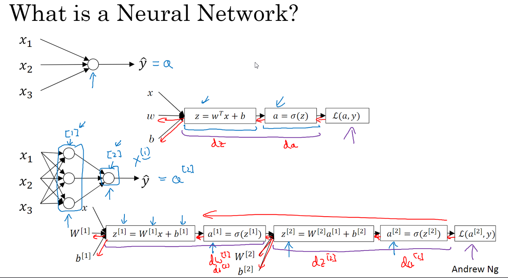

反向传播也要求几个da, dz, dw,db

## 神经网络表示

输入层 x1, x2,x3

隐藏层 一个相当于一个隐藏层

输出层 一个相当于一个输出层

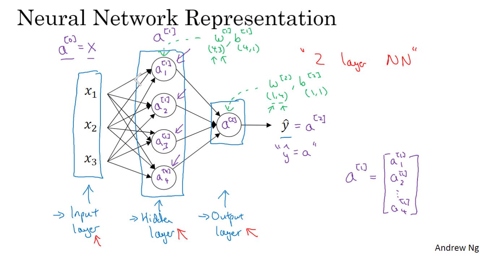

双层神经网络

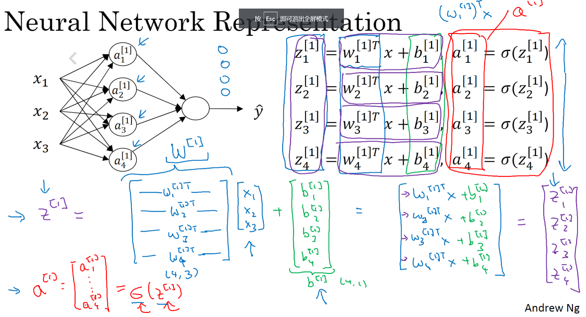

进行向量化后挺简单的

## 多个例子向量化

横向扫描扫描了训练集,第一个样本,第二个样本

竖向,隐藏单元指标

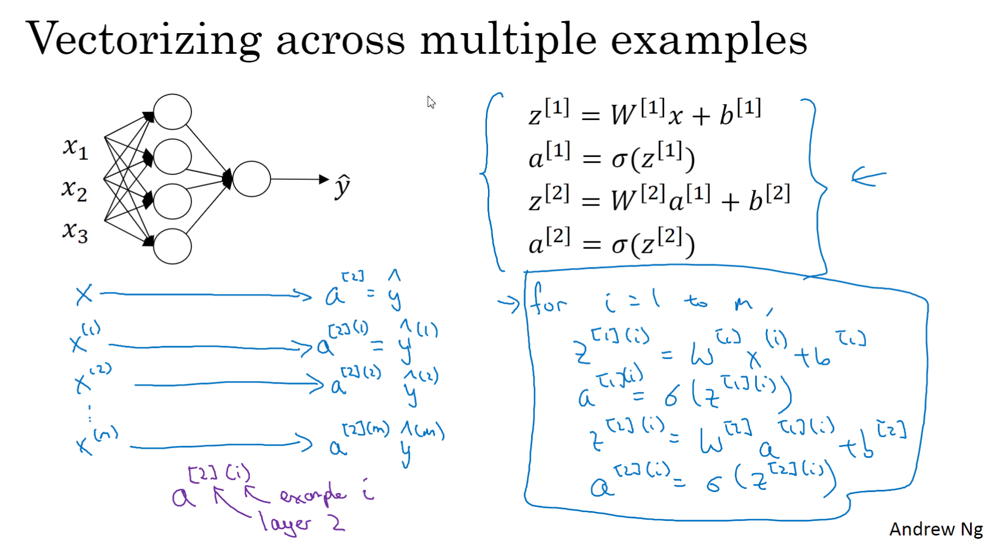

多个用for循环表示,然后向量化

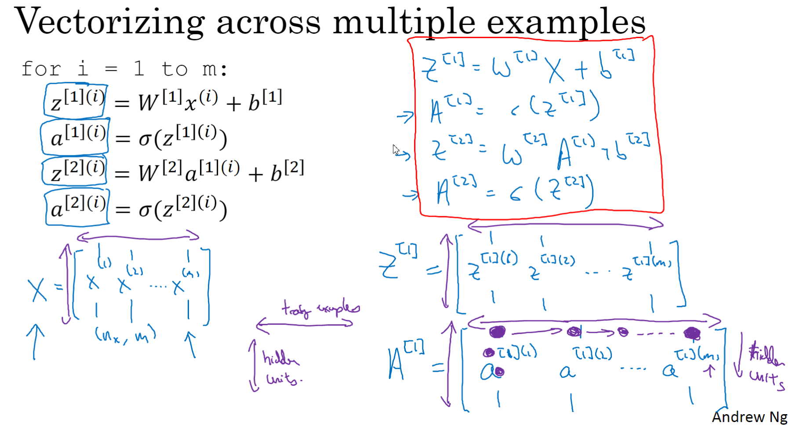

## 向量化实现的解释

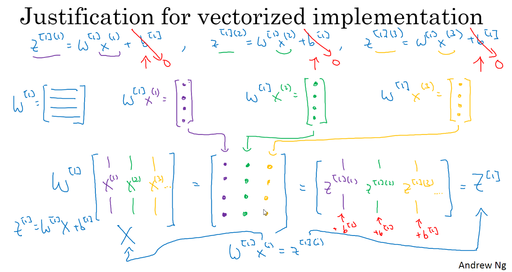

为了简化忽略b, 

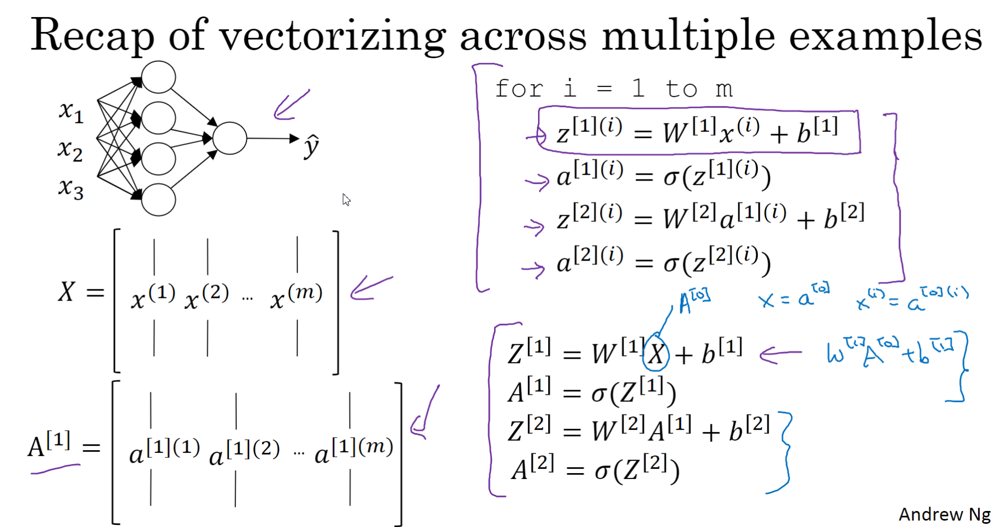

## 不同种类的激活函数

1. sigmod激活函数
2. tanh激活函数
3. Relu激活函数

tanh通常比sigmod激活函数要好

几乎不用sigmod函数了

二元分类通常用sigmod函数(输出为0货1)

不确定隐层用Relu, 在0时候可以设置导数为0或1,尽管不可微

ReLu比tanh和sigmod快一些

Relu为0 的概率很小,所以问题不大

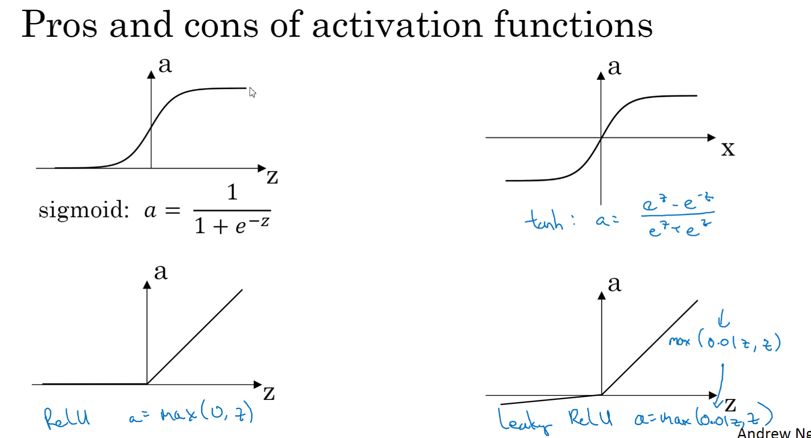

## 为什么需要非线性激活函数

回归问题用线性激活函数,不然的话, 用线性激活函数,造成隐层没有效果,一直都是在计算线性激活函数

输出层可以用线性激活函数

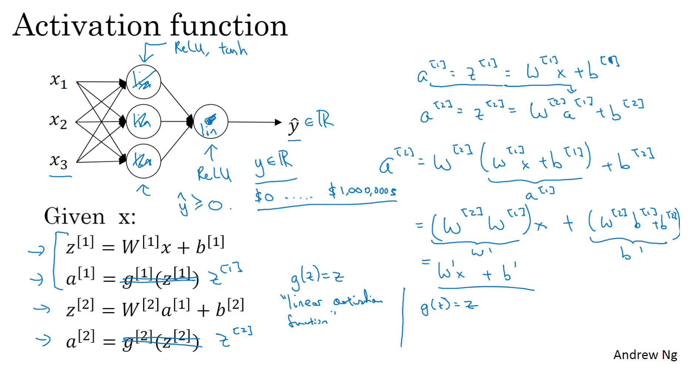

线性的组合还是线性

## 激活函数的导数

sigmod

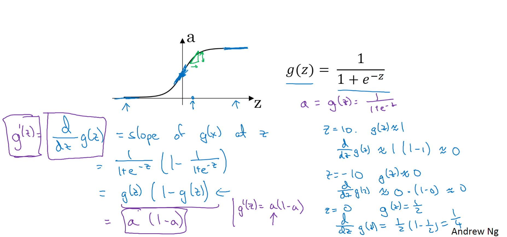

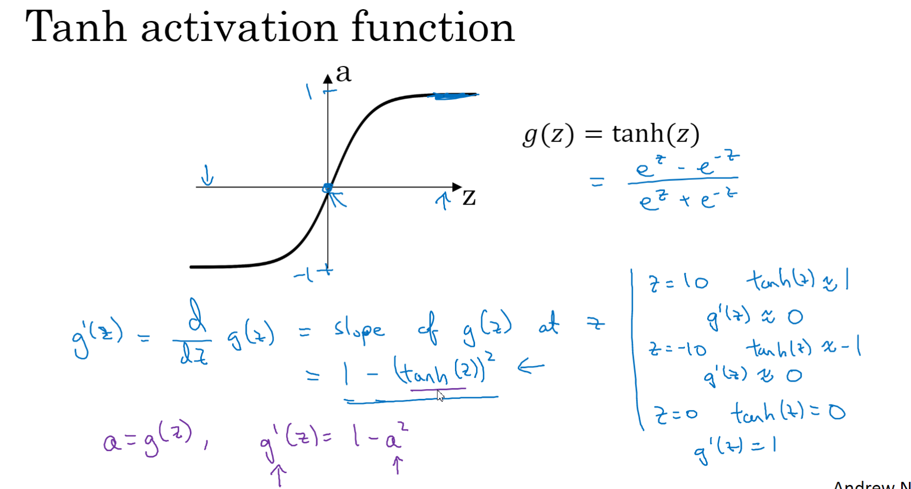

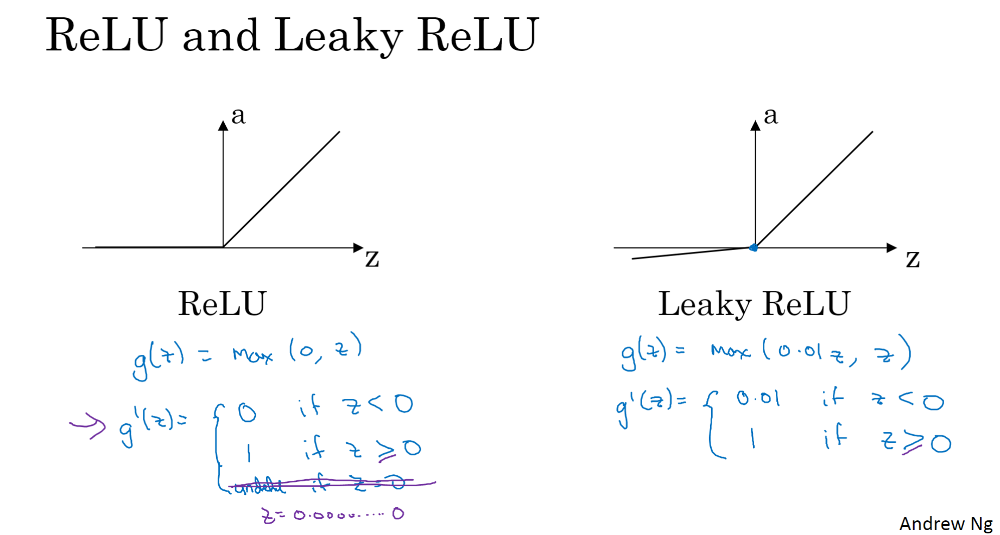

## 神经网络的梯度下降

keepdims保持矩阵的维度, axis按行相加

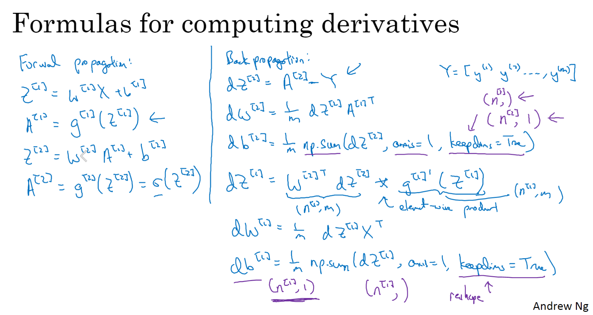

##  随机初始化

不随机初始化,用0的话, 中间的隐藏单元在计算相同的事情,

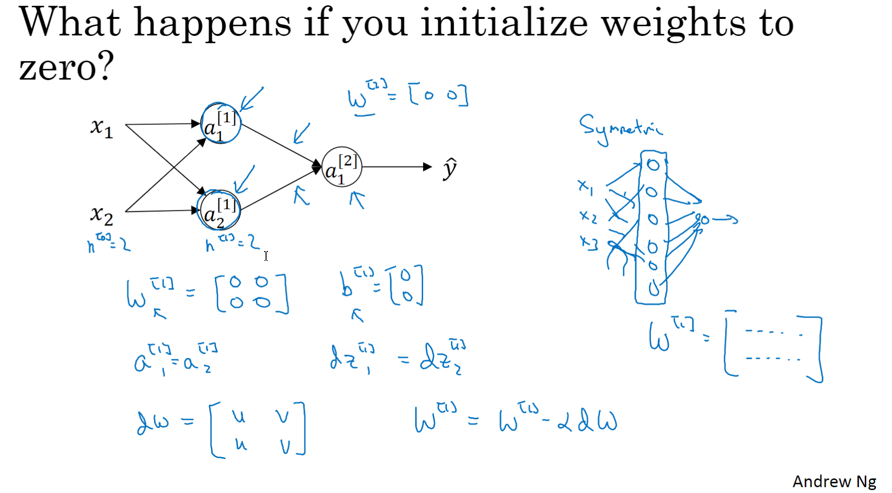

W全初始化为0, 就会导致上述情况,a1跟a2相同

W = np.random.randn((2,1)) * 0.01

0.01为权重

如果W太大的话,就会让Z落在非常大或者非常小的地方,这会使得梯度下降十分缓慢

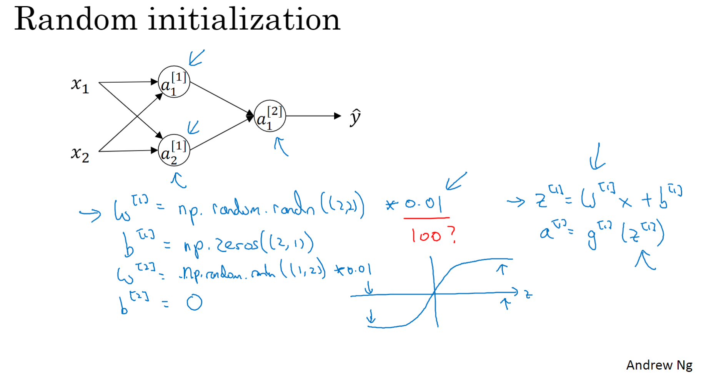

上图就是说明权重的设置问题

单层或者较浅的神经网络,用0.01还行,非常多层的可能不适合用0.01

