# 02-深层神经网络

## 深层神经网络

逻辑回归是一个浅层神经网络,严格来说逻辑回归是单层神经网络

算隐层跟输出层, 计算几层神经网络

符号标注

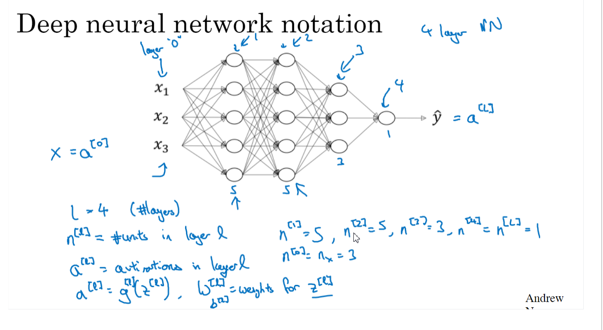

## 深层网络的前向传播

多层实际也就一个for循环求就行, 4层隐层就用循环1到4

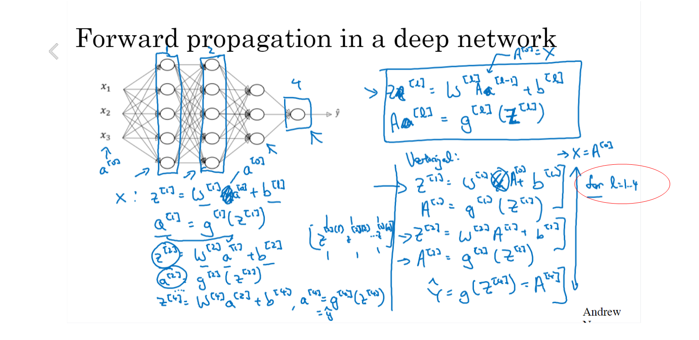

## 核对矩阵的维数

这个好算, 我们已知结果层, 假设为3*1 = WX + b

X为(2,1) 则W为(3,2), b为(3,1)

同理可以推到每层矩阵的维度

不知道矩阵维度不好调试

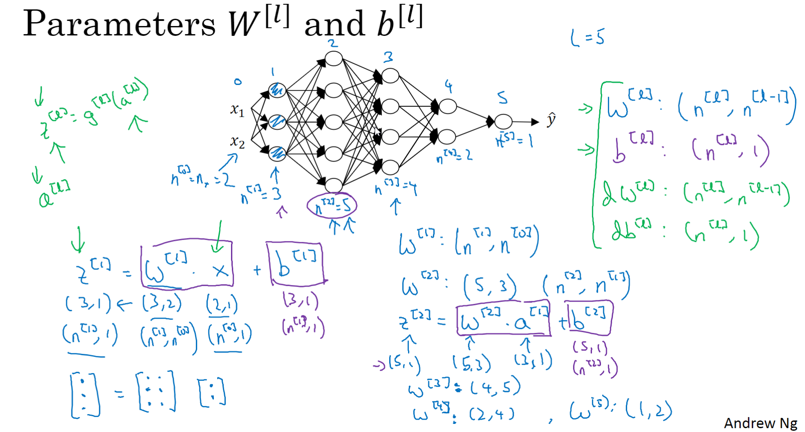

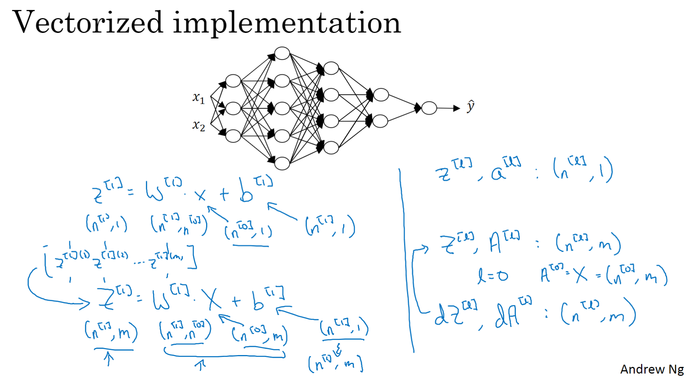

## 为什么使用深层表示

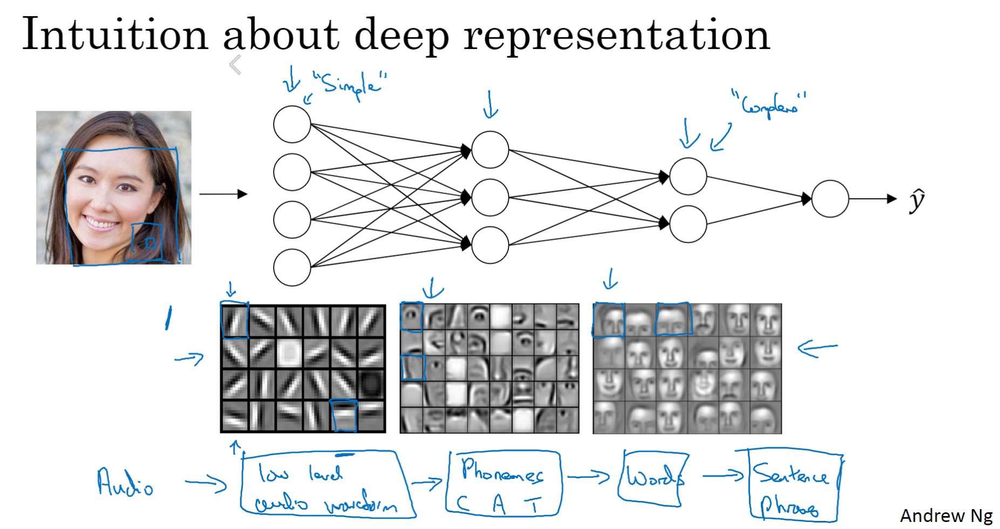

看上图,第一层就是探测边缘,第二层就探测组件了,第三层就可以探测人脸了

如果用单层

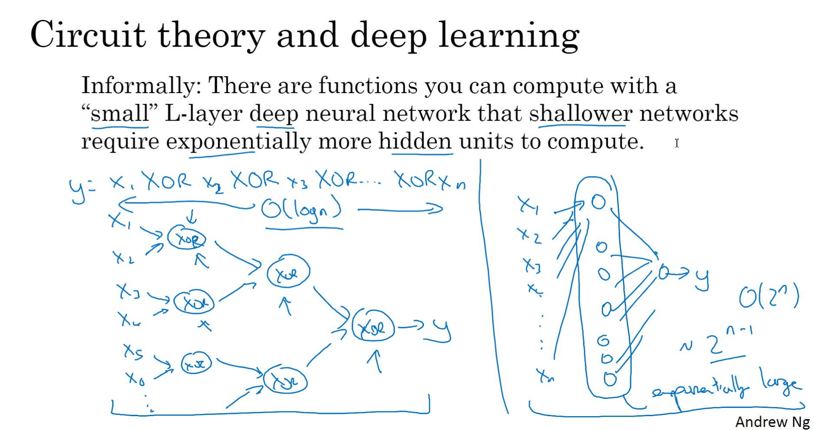

你看,计算xor电路,单层的话,在右边的话,需要很多的隐层单元

而左边的话,不是按指数级增加隐层单元

## 搭建深层神经网络块

前向传播与反向传播

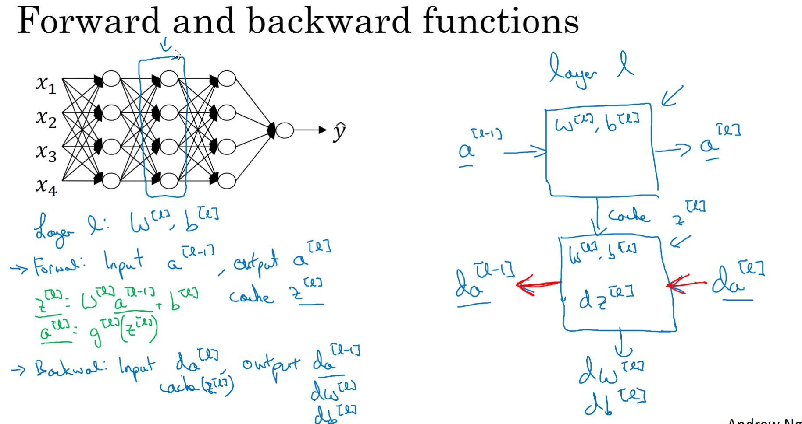

先计算前向传播,然后计算反向传播

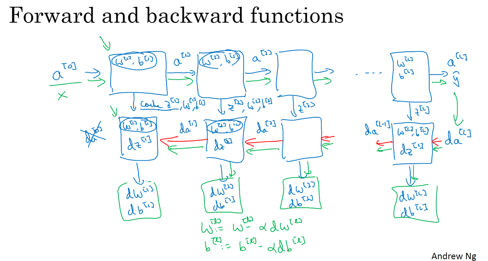

同时,我们可以缓存Z,0

(W, b)这样在反向传播的时候计算会相对方便

## 前向传播, 反向传播

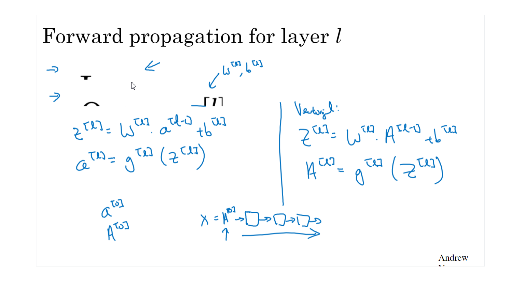

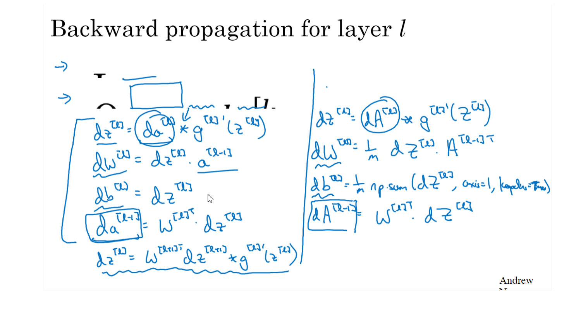

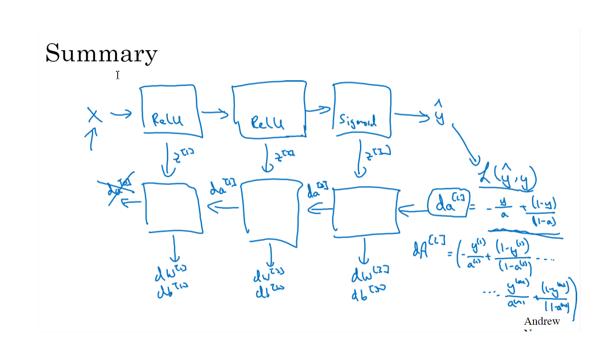

跟原来的也差不多

## 参数与超参数

- 学习率 α

- 梯度下降循环数量

- 隐层数

- 隐层单元数

- 激活函数个数

这些参数决定了最终得到的W和b

试试修改α,会降低损失函数不, 如果可以就继续, 调参

最优质值是会变的,CPU和GPU都会影响, 可能几个月一变

minibatch size

## 深度学习与神经元关系

简化的神经元

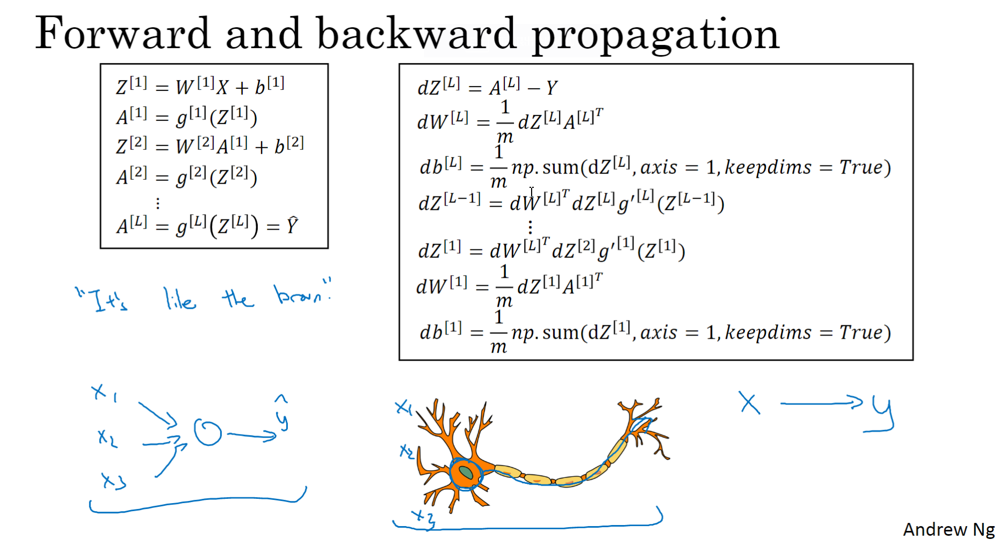

突触与下一个神经元的接触

