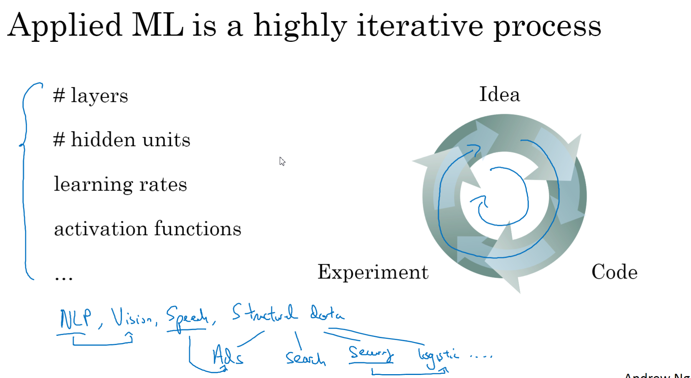
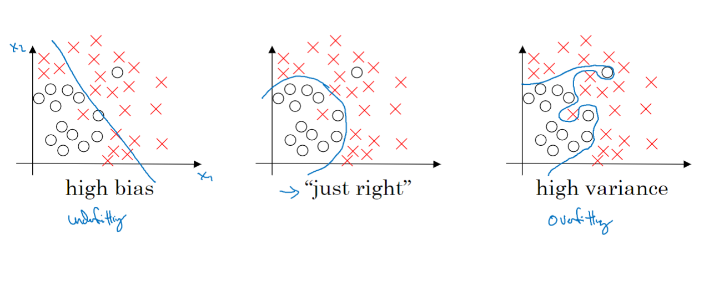
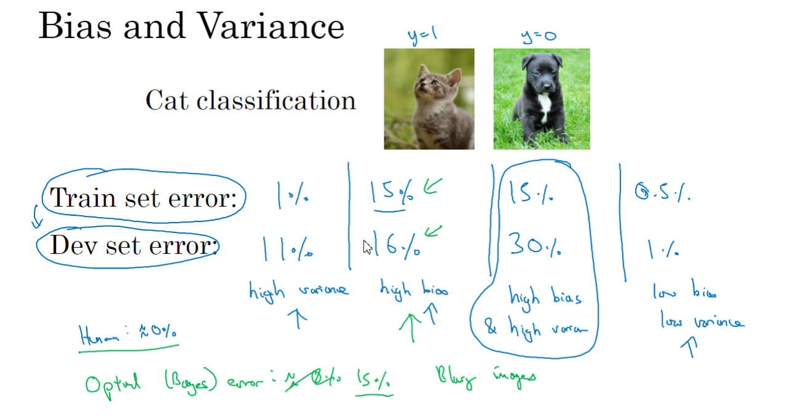
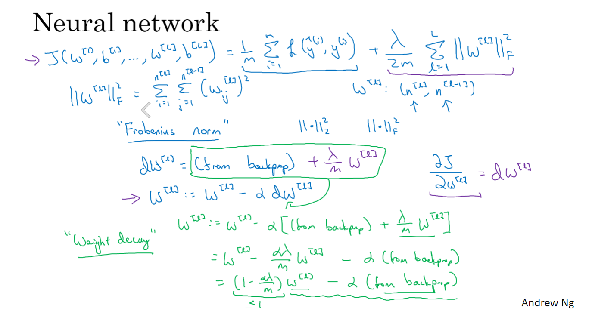
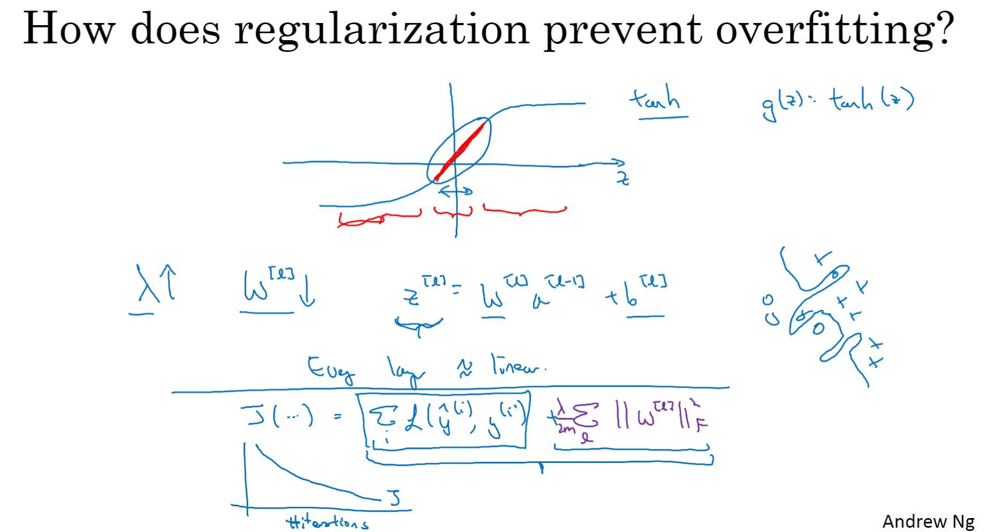
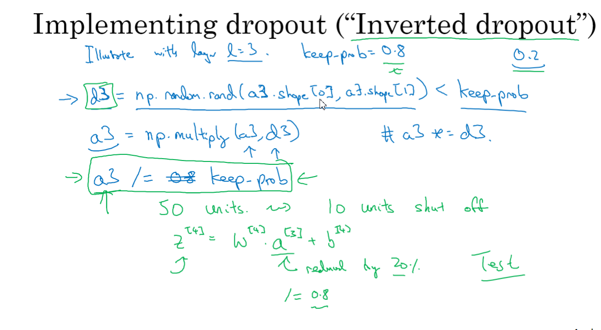
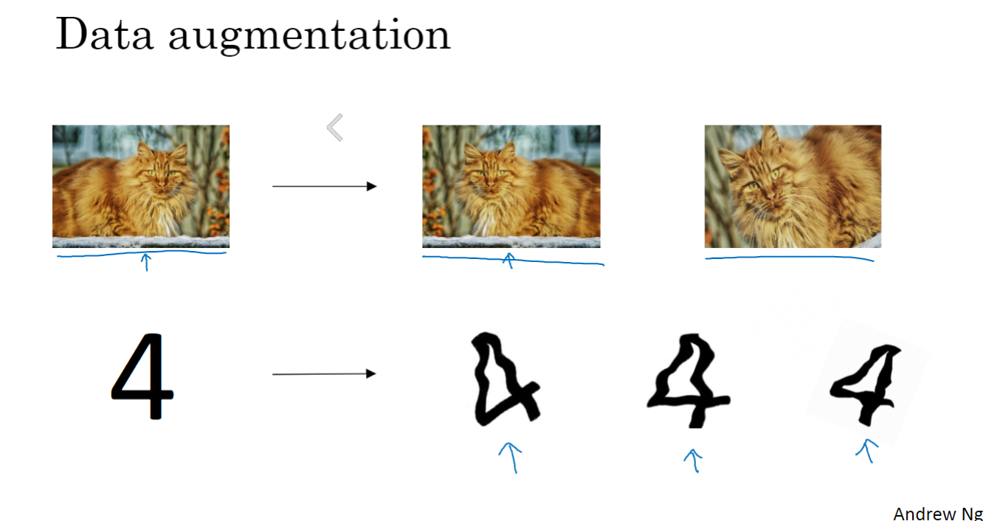
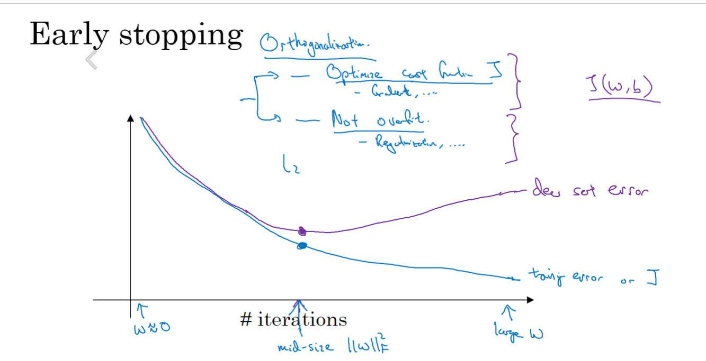

# 03-深度学习的实践

## 训练,测试,开发集

多次循环迭代找到适合的

70%验证, 30%测试,机器学习

60%, 20%,20%

现在训练集98%,验证测试占较少

训练集网上下载的,

验证和测试用用户上传的,确保验证和测试在同一个分布

没有测试集也可以

## 偏差与方差

欠拟合 高方差

适度拟合

过拟合

训练集误差和验证集误差 

最好的就是最后一个,都很小

## 机器学习

正则化预防过拟合

不断尝试也可以, 要了解出是方差还是偏差影响

## 正则化

1. L2正则化
2. L1正则化 (用L1使模型变得稀疏)

dw+一个范数,其余不变

## 为什么正则化可以防止过拟合

一张图就可以解释,我们增大 入, W相对减小, 由于Z= W a+b 所以Z相对减小,所以就靠近中间那里, 造成线性,线性的话就可能变成高偏差了,而不是过拟合了

## dropout正则化

keepprob 保留概率

反向随机失活

测试阶段不用dropout

/= keepprob

大概就是这个过程

对于比较多的层就应用较小的keep-prob

对于比较少的层就可以应用1或者较大的keep-prob

## 其余的正则化

数据扩增 可以正则化,没有新的数据可以翻转图片什么的

修改图片,达到扩充数据集

early stopping

提早终止

## 正则化输入

u跟6 调整输入, 训练集得来的

## 梯度消失与梯度爆炸

## 神经网络的权重的初始化

Relu用 2/n

np.sqrt(2/n[L-1])

## 梯度的数值逼近

