# 04-优化算法

## Mini-batch

拆分训练集为子训练集

就是拆分,拆分后一样的计算

size = m 就是batch梯度下降法 数据量大 too long

size =1, 随机梯度下降法,很多噪声, 在最小值附近波动, 一个样本,通过改善学习率可以

size 1-m  实际较适合 

- 大量向量化样本
- 不需要等待完后在执行, 减少学习率

训练集较小 直接使用batch梯度下降法, 小于2000个样本

min-batch size 64-512 样本较多, 2的n次方运行较快, 64 128 256 512通常

x{t}, Y{t}要与cpu与gpu符合

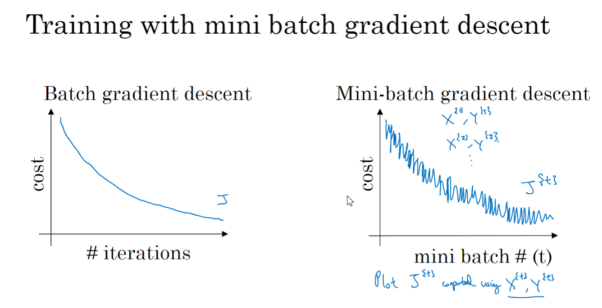

## 指数加权平均

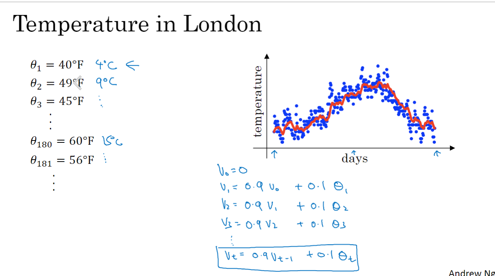

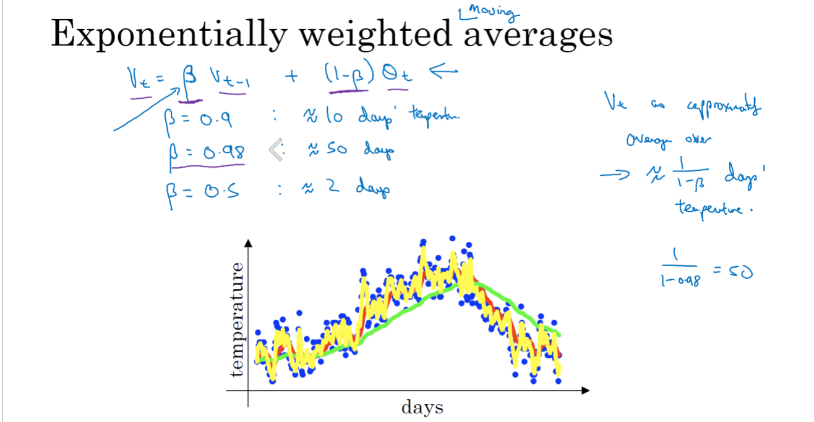

0.9 10天差不多

0.8 50次

要 = 1/e 差不多

实际:

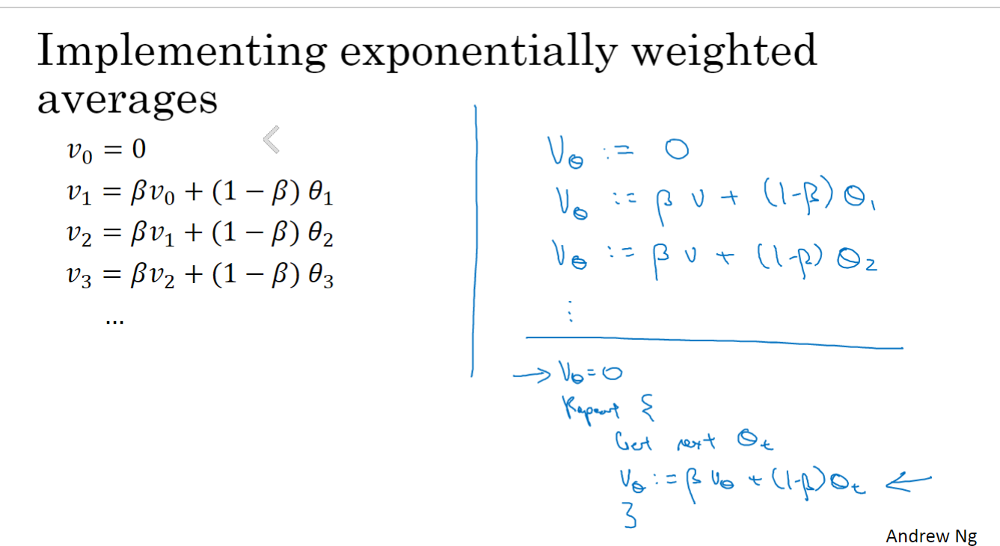

## 偏差修正

vt/1-β的t次方

热身

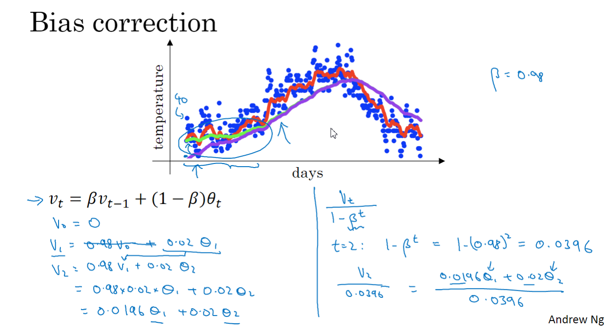

## 动量梯度下降法

Momentum梯度下降法

用加权来减缓纵轴上的摆动

通常用β=0.9

梯度下降与momentum不会受到偏差修正影响,通常不用偏差修正

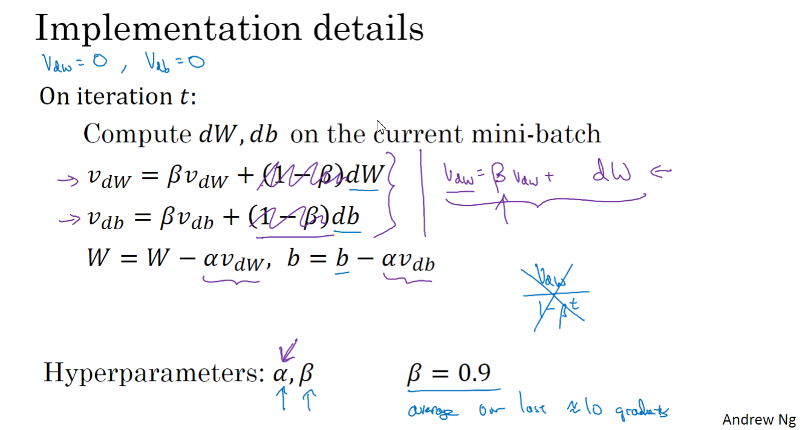

## RMSprop

利用除法加权来使得方向上的减缓

均方根

想降低波动就除以较大的数, 想提高就除以较小的数

实际要加上一个很小的数

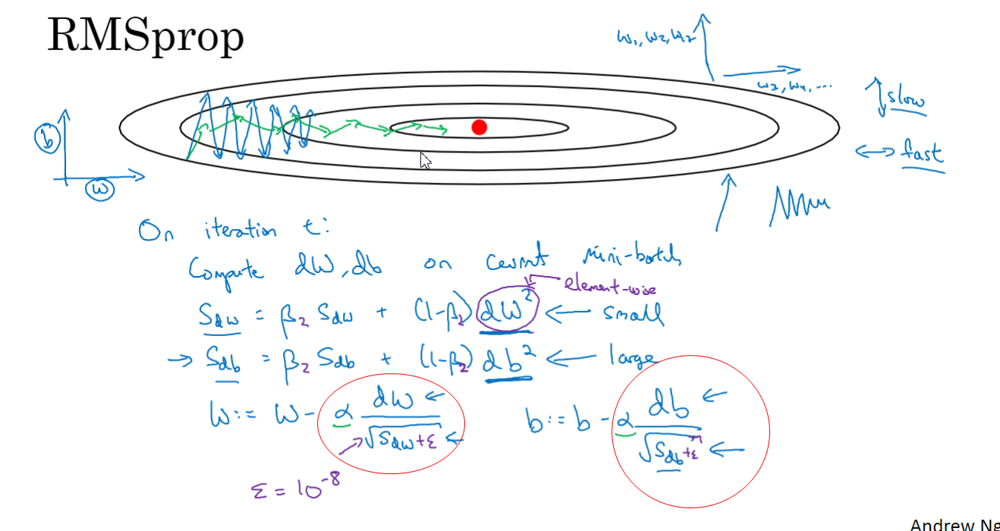

## Adam

结合了Momentum和RMSprop

β1: 0.9

β2: 0.999

Adam过程

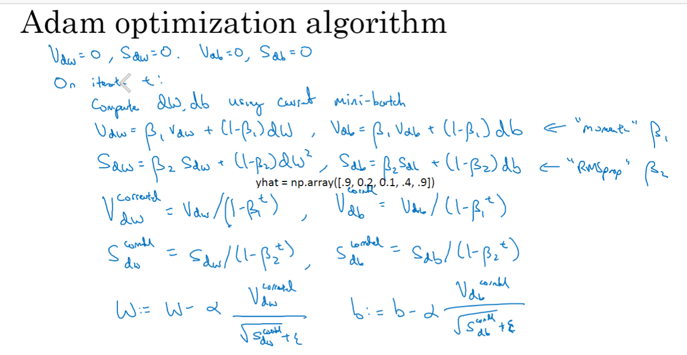

超参数设置

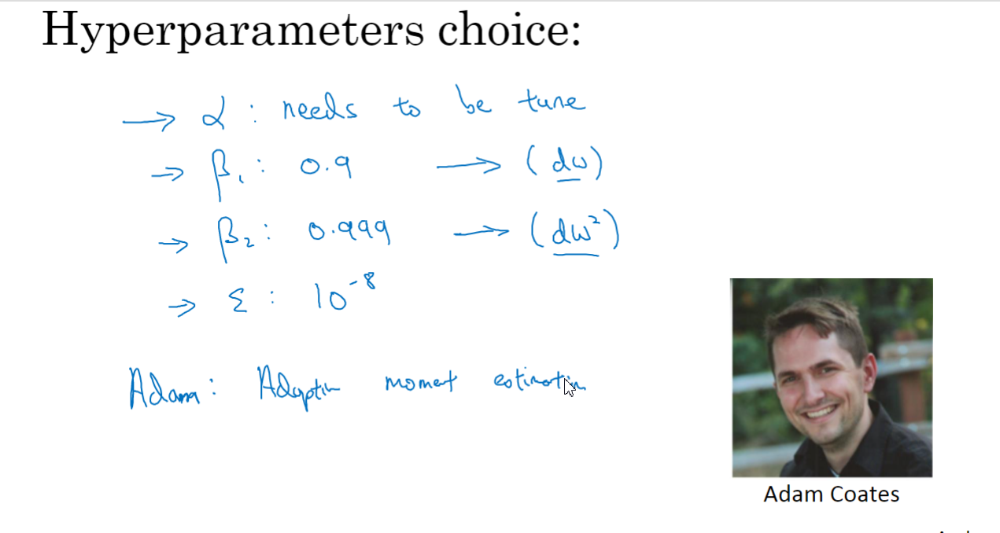

## 学习率衰减

噪音,减少α,开头比较大,小一些使其在最小值附近波动

第一次遍历训练集就是叫第一代 epoch

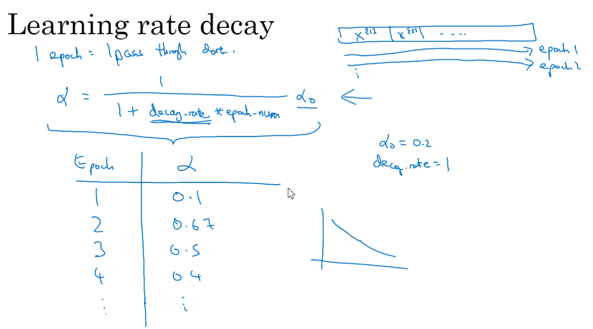

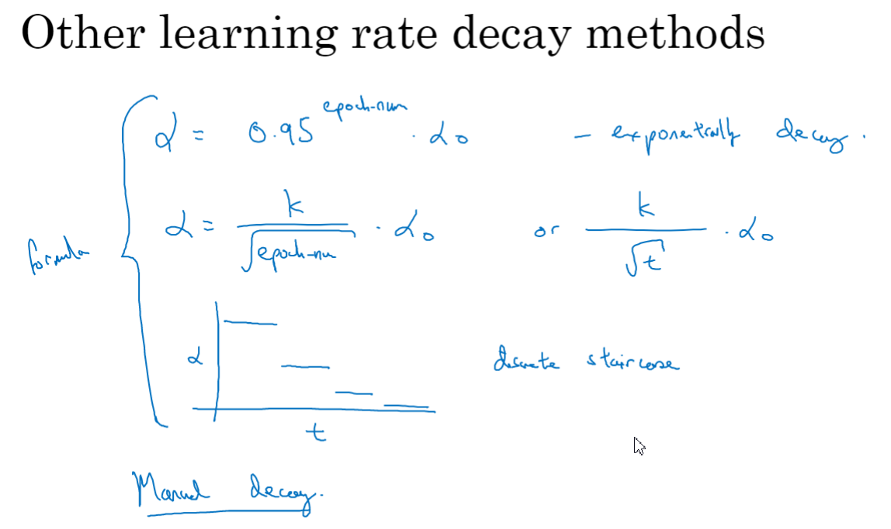

## 局部最优

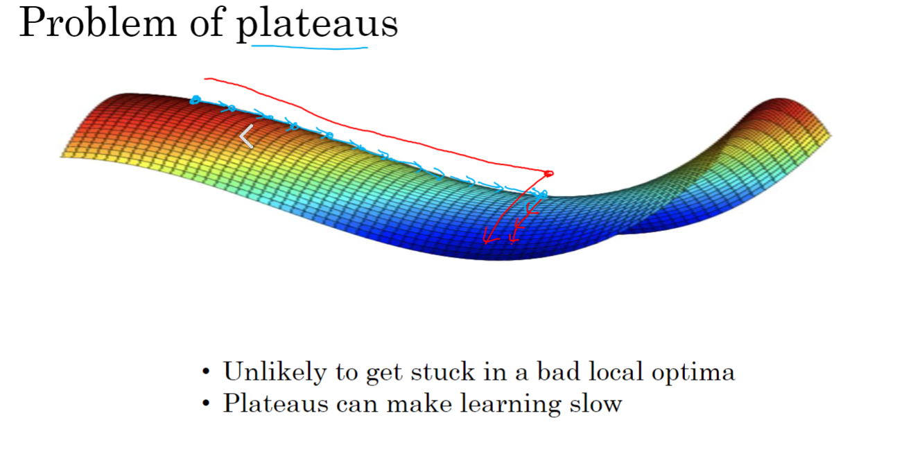