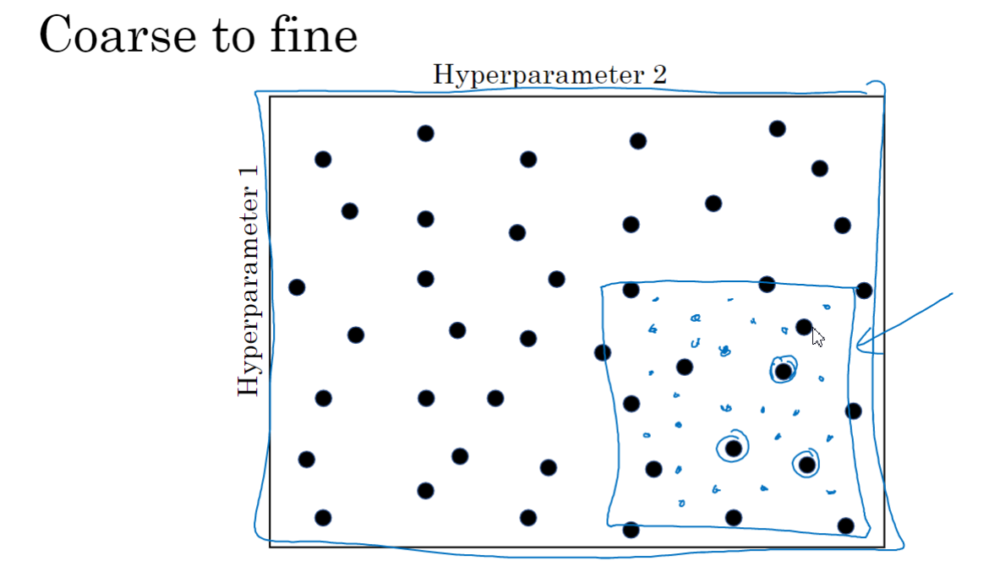
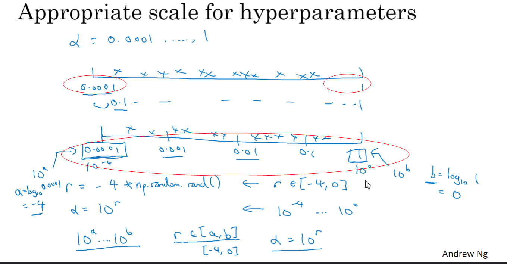
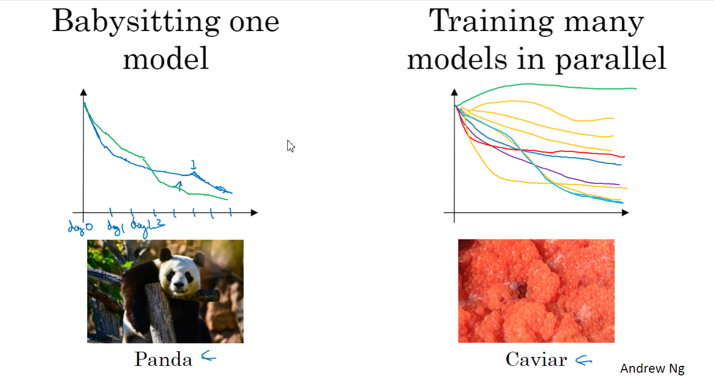
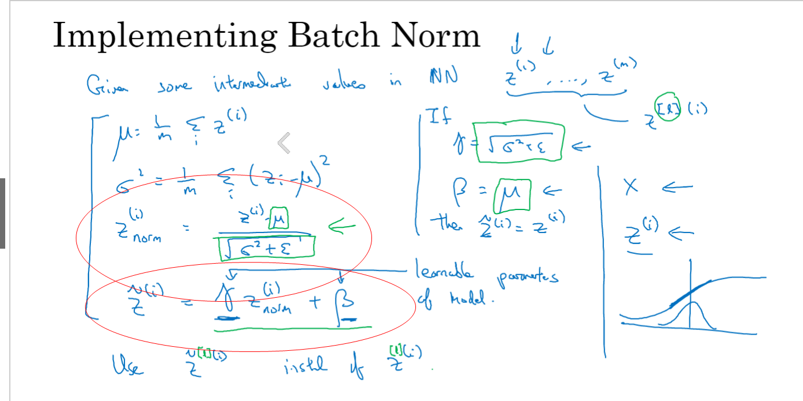
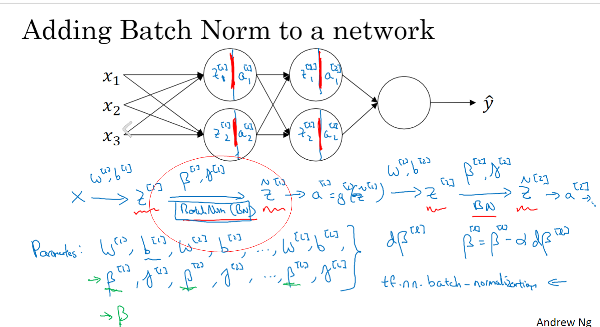
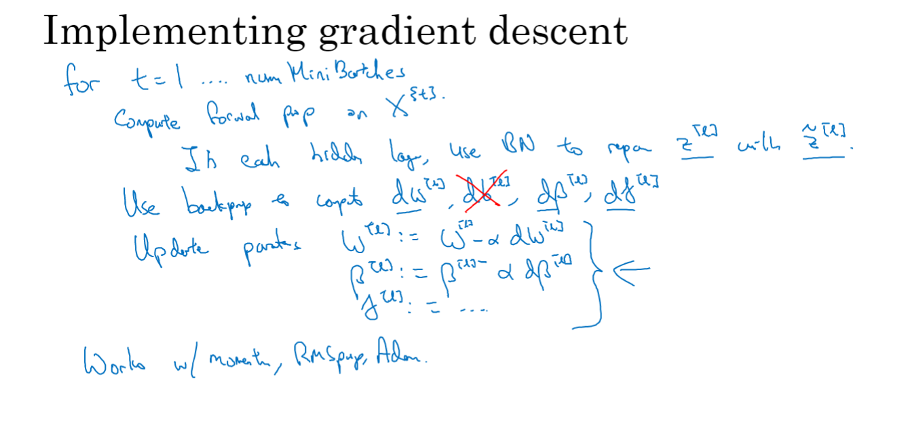
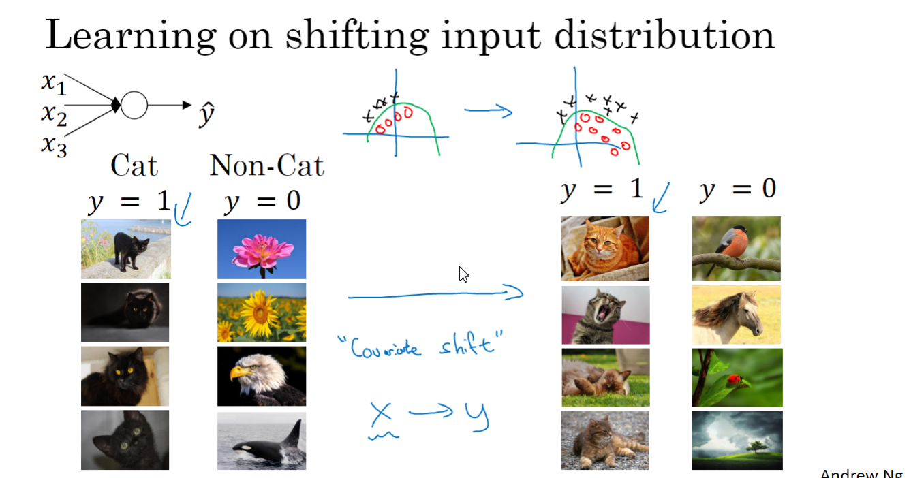

# 05-超参数调试

## 调试处理

学习率比较重要

粗糙到精细, 随机选,然后集中,继续随机,然后随机

迭代查找

## 合适的范围

不应该太密集, 单体选比较好,也就是说,先整个大的

## 训练的实践

- Panda
- Caviar

足够计算机,用Caviar

不足, 用Panda方式

## 正则化网络的激活

Batch归一化

## Batch Norm融进神经网络

每次先做归一化

b其实用不上

原因

没太听懂,先放着吧

## 测试时的Batch Norm

## SoftMax回归

