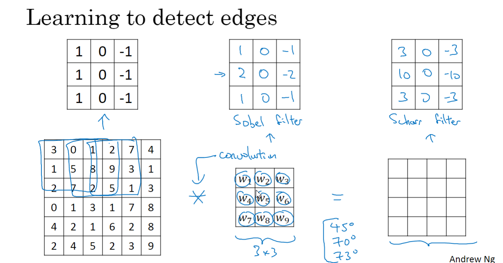
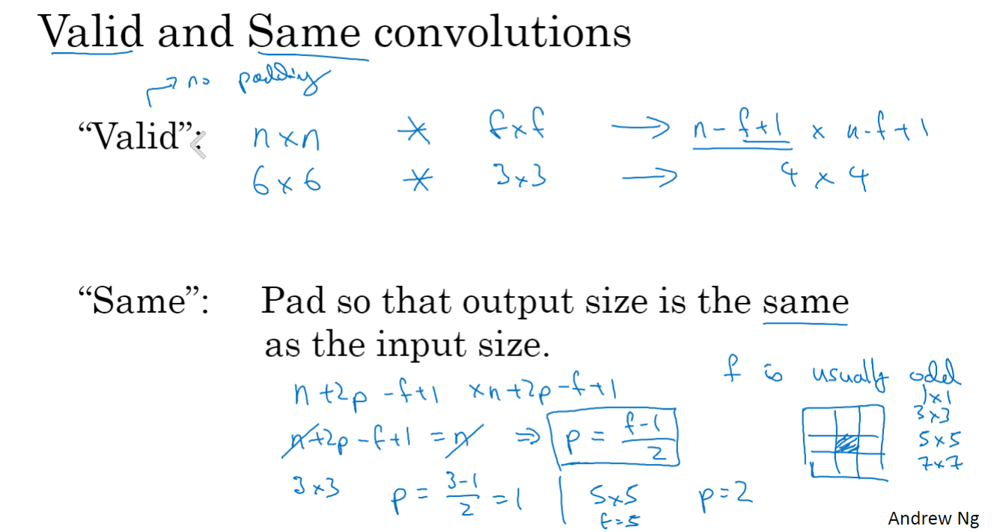
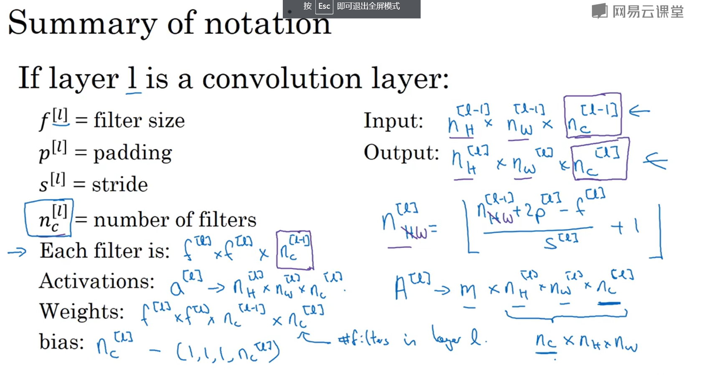
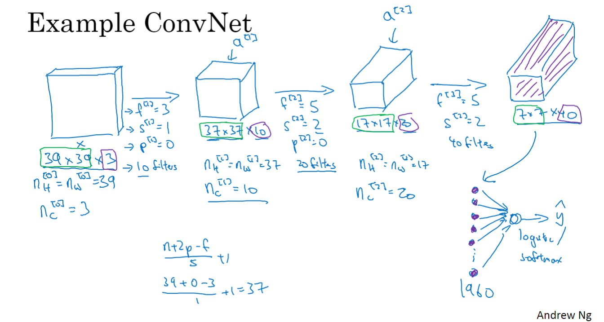
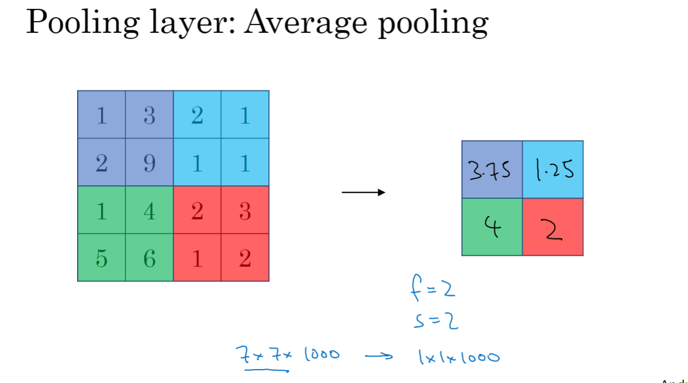
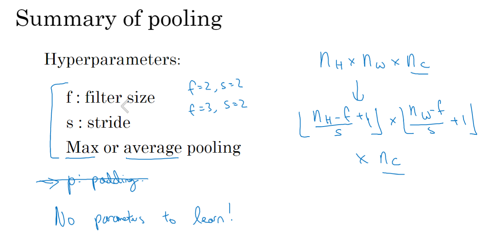
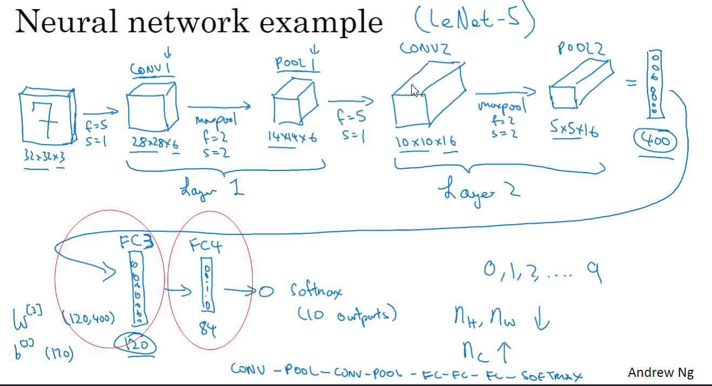

# 06-卷积网络

大图片太多输入了,所以要用卷积

## 边缘检测

用过滤器去盘

tf.nn.conv2d

keras Conv2D卷积

这张图非常形象,说明了检测明亮区域与暗区域, 就标明了垂直边缘

## 更多边缘检测

可以检测不同角度,方位的边缘

## padding

(n-f+1)* (n-f+1) 本来是这样

填充一层, 这样移动的话,还是原来的大小

(n+2p-f+1) * (n+2p-f+1)

- Valid 

- Same

p = f-1/2  填充的像素点

f通常是奇数

## 卷积步长

每次移动的长度

((n+2p-f)/s+1) * ((n+2p-f)/2 +1 )

向下取整

s为步长, n*n为image f * f为filter

翻转镜像, 互相关,通常不进行翻转

信号处理与数学处理用得到这个

## 卷积为何有效

height, width, channels

高,宽,通道数

多过滤器,可以同时检测水平边缘和垂直边缘

## 单层卷积网络

只是加上偏差并且加上激活函数

实例

## 池化层

最大池化

求出每个区域内最大, 结果为

| 9    | 2    |
| ---- | ---- |
| 6    | 3    |

平均池化

每个池内, 求平均

总结:

- 深度很深的用平均, 通常用最大池化

- 常用f=2, s=2

- 池化不需要学习

## 全连接

卷积和池化合为一层, 通常只计算带有权重的为层

全连接层

