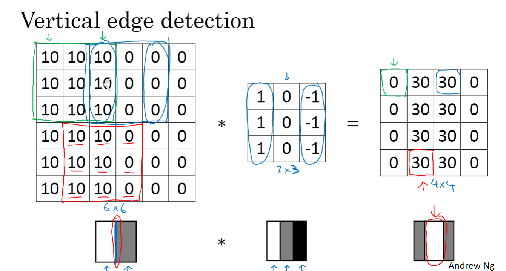
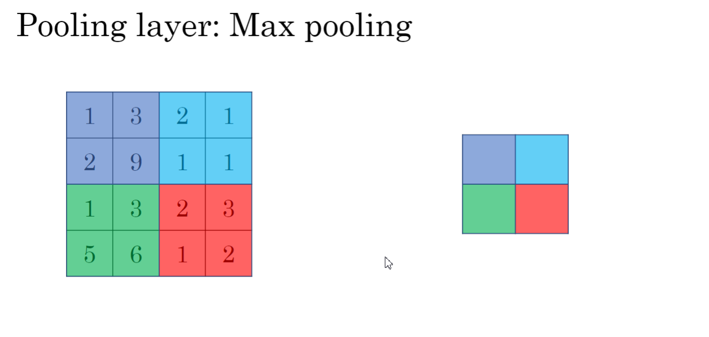

# CNN验证码识别

## 分类问题

验证码识别其实可以转换为分类问题, 这里为4位数字验证码,每位验证码有10种可能,所以为4分类问题,每个有10层

## One shot

通过对比差异, 然后达到判别的, 这里的one_hot实际就是将分类问题实际化,

比如验证码为: 0123

第一个验证码, [1,0,0,0,0,0,0,0,0,0]

就识别为标志为1,其余为0

## 卷积网络

这里用了5层卷积,每层卷积用Batch Norm加上一层池化

在后面将其降到一维后,在将其dropout 随机失活

最后全连接层4个分类器,每个分类器10个节点,也就是10类数字,4位验证码

池化层作用: 边缘检测

最大池化

求出每个区域内最大, 结果为

| 9    | 2    |
| ---- | ---- |
| 6    | 3    |

## Batch Norm

该层在每个batch上将前一层的激活值重新规范化，即使得其输出数据的均值接近0，其标准差接近1

